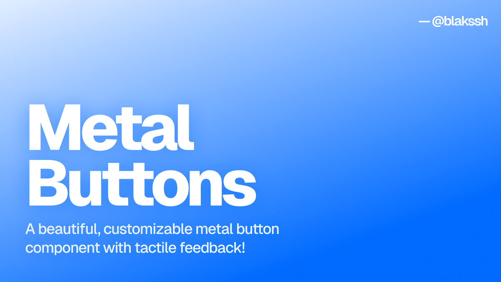

<h1 align="center">Metal Buttons</h1>

<p align="center">


</p>

<a href="https://metal-buttons.lakshb.dev">
  
</a>

## Installation

For npm or yarn:

```sh
npx shadcn@latest add https://button.lakshb.dev/r/metal-button.json
```

For pnpm:

```sh
pnpm dlx shadcn@latest add https://button.lakshb.dev/r/metal-button.json
```

For bun:

```sh
bunx --bun shadcn@latest add https://button.lakshb.dev/r/metal-button.json
```

## Usage

```tsx
import { MetalButton } from "@/components/metal-button";
```

```tsx
<MetalButton variant="default">Default</MetalButton>
```

## License

This project is licensed under the MIT License. See the [LICENSE](LICENSE) file for details.

## Contributing

If you have any suggestions or improvements, please create an issue or a pull request. I'll try to respond to all issues and pull requests.

## Support

If you like this and other projects, you can sponsor me on [GitHub](https://github.com/sponsors/lakshaybhushan) or
[buying me a coffee](https://www.buymeacoffee.com/lakshaybhushan).

<a href="https://www.buymeacoffee.com/lakshaybhushan" target="_blank"></a>
